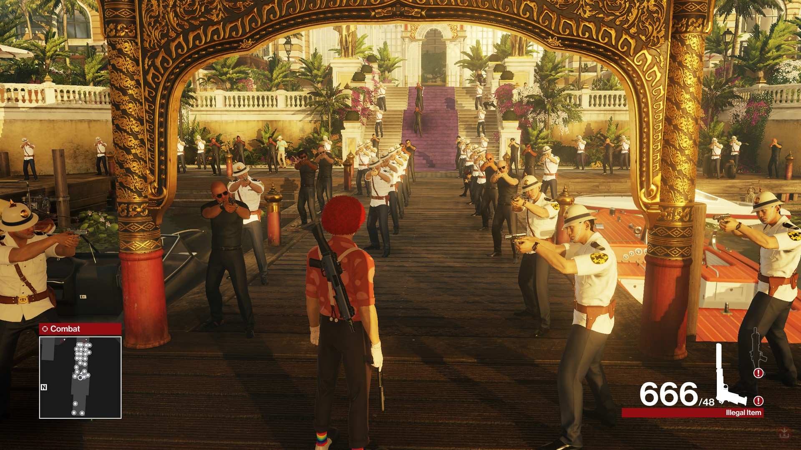

# GameCheats

- This repository contains runtime applicable (mostly) cheats for various video games
- Some of them might be flaky and crash your game
- The goal of this repository is mainly to learn x86 and x64 assembly even though most of it is written directly in machine code

	
	<b><i>Hitman&trade; (2016) with some cheats applied</i></b>

## Releases

- Check [Actions/Artifacts](https://api.github.com/repos/visuve/GameCheats/actions/artifacts)

## Building

- Requirements
	- Visual Studio >= 2022 with C++ Desktop development workload
		- Remember to include CMake

- See steps [build x86](.github/workflows/msvc.yml#L12-L16=) and [build x64](.github/workflows/msvc.yml#L20-L22=) how to actually build this repo

## Principles

- Minimum 3rd party dependencies
- Minimal build environment setup

## Licensing

- See 
- Please contribute if you find this repository interesting
